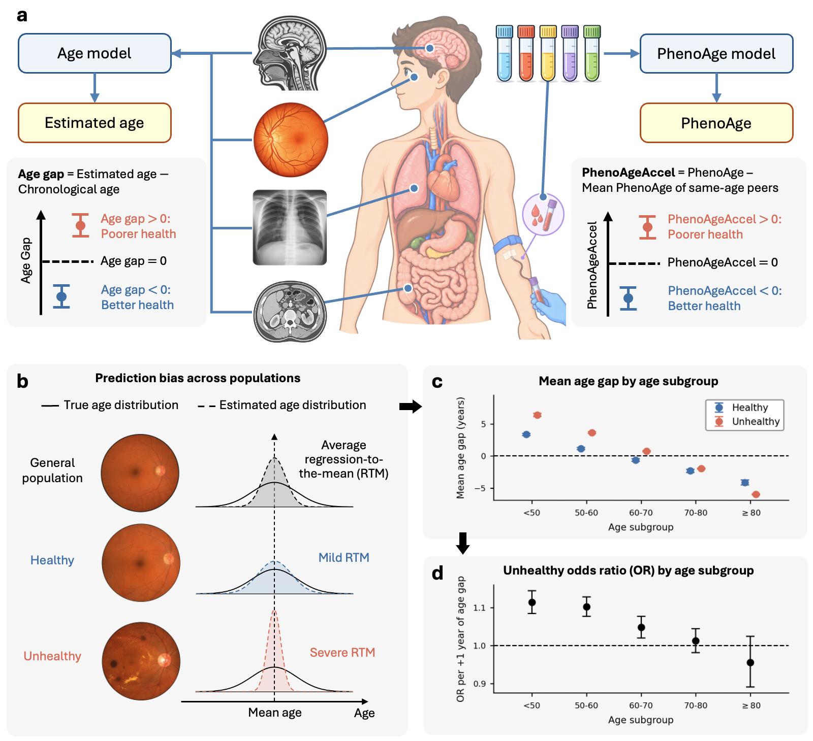
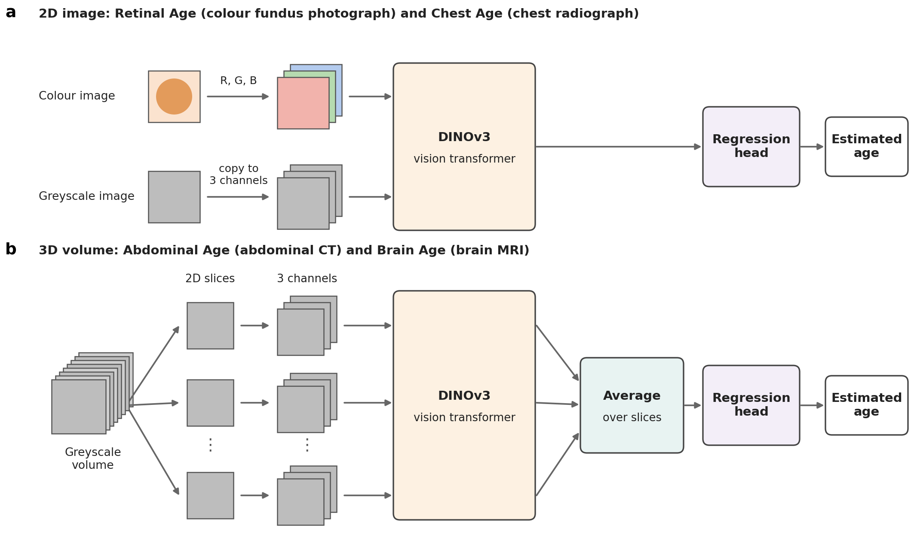

# AG-RTM — Prediction bias in biological ageing models

AG-RTM provides the code and model weights for four ageing markers that estimate age from medical images: Retinal Age, Chest Age, Abdominal Age and Brain Age. The age gap is the estimated age minus chronological age. The study behind this code shows that the age gap is pulled towards the mean age more strongly in unhealthy than in healthy people (differential regression to the mean, RTM). This prediction bias changes how the age gap relates to health at different ages.

[Preprint](https://www.researchsquare.com/article/rs-10157626/v1) · [Weights](#2-get-model-weights-and-data) · [Datasets](#2-get-model-weights-and-data)

**Prediction bias in biological ageing models**  
Yiqun Lin, Ariel Yuhan Ong, Matthew Yu Heng Wong and colleagues · Preprint, *Research Square* (2026)

## Highlights

- Four age models, one per organ: colour fundus photographs, chest radiographs, abdominal CT and brain MRI. Each model fine-tunes DINOv3-Large on healthy patients to estimate chronological age.
- In all four models, the age gap falls faster with age in unhealthy than in healthy patients (differential RTM).
- This prediction bias remains after age calibration and after training on a balanced age distribution.



*Figure 1. Study overview and prediction bias in ageing models. **a.** Ageing markers and their age gaps. **b.** Prediction bias across populations: RTM is mild in the healthy and severe in the unhealthy population. **c.** Mean age gap by age subgroup for Retinal Age on the AlzEye test subset. **d.** Odds ratio for unhealthy status per 1-year increase in the age gap, by age subgroup, for the same data.* [View full-size image](images/method-overview.png).

## Released models



*Figure 2. Model architecture. **a.** Retinal Age and Chest Age take a single 2D image. **b.** Abdominal Age and Brain Age take a volume: 32 axial slices are encoded one by one with the same DINOv3 backbone, and their features are averaged before the regression head.* [View full-size image](images/model-architecture.png).

| Model | Input | Training data | Test MAE (years) | Weights |
|---|---|---|---:|---|
| Retinal Age | Colour fundus photograph (2D) | AlzEye | 5.31 | [lyqun/AG-RTM](https://huggingface.co/lyqun/AG-RTM) |
| Chest Age | Frontal chest radiograph (2D) | ChestX-ray14 | 5.15 | [lyqun/AG-RTM](https://huggingface.co/lyqun/AG-RTM) |
| Abdominal Age | Abdominal CT (2.5D, 32 axial slices) | Merlin | 4.04 | [lyqun/AG-RTM](https://huggingface.co/lyqun/AG-RTM) |
| Brain Age | T1-weighted brain MRI (2.5D, 32 axial slices) | OASIS-3 | 3.81 | [lyqun/AG-RTM](https://huggingface.co/lyqun/AG-RTM) |

Test MAE is reported on each cohort's test subset, as in the paper: 65,360 images (Retinal Age), 21,733 radiographs (Chest Age), 4,984 volumes (Abdominal Age) and 1,454 sessions (Brain Age). Each model was trained on healthy patients only. The checkpoint with the lowest validation MAE was kept.

## Getting started

### 1. Install

Install the environment and dependencies:

```bash
git clone https://github.com/HORIZONHealthcare/AG-RTM.git
cd AG-RTM
conda create -n ag-rtm python=3.11 -y
conda activate ag-rtm
pip install -r requirements.txt --extra-index-url https://download.pytorch.org/whl/cu121
```

Retinal Age reads JPEG photographs, and JPEG decoders do not all give the same pixels. The paper's results used Pillow built with IJG libjpeg 9e. The pip Pillow uses libjpeg-turbo instead. With it, predictions differ by 0.2 years on average, and the test MAE is 5.3152 rather than 5.3145. To reproduce the paper's Retinal Age numbers exactly, replace Pillow with the Anaconda build:

```bash
pip uninstall -y Pillow
conda install -y -c defaults --override-channels pillow=11.3.0
```

In the paper, the other three models read lossless files (PNG and NIfTI), so they are not affected.

### 2. Get model weights and data

| Resource | Link | Use |
|---|---|---|
| Retinal Age model | [Model card](https://huggingface.co/lyqun/AG-RTM) · [Checkpoint file](https://huggingface.co/lyqun/AG-RTM/blob/main/retinal_age.pth) | Colour fundus photographs |
| Chest Age model | [Model card](https://huggingface.co/lyqun/AG-RTM) · [Checkpoint file](https://huggingface.co/lyqun/AG-RTM/blob/main/chest_age.pth) | Frontal chest radiographs |
| Abdominal Age model | [Model card](https://huggingface.co/lyqun/AG-RTM) · [Checkpoint file](https://huggingface.co/lyqun/AG-RTM/blob/main/abdominal_age.pth) | Abdominal CT volumes (NIfTI) |
| Brain Age model | [Model card](https://huggingface.co/lyqun/AG-RTM) · [Checkpoint file](https://huggingface.co/lyqun/AG-RTM/blob/main/brain_age.pth) | T1-weighted brain MRI (NIfTI) |
| ChestX-ray14 | [NIH Clinical Center](https://nihcc.app.box.com/v/ChestXray-NIHCC) | Public download |
| Merlin | [Stanford AIMI](https://stanfordaimi.azurewebsites.net/datasets/60b9c7ff-877b-48ce-96c3-0194c8205c40) | After its data use agreement |
| OASIS-3 | [OASIS](https://www.oasis-brains.org) | After the OASIS data use agreement |
| AlzEye | [INSIGHT Health Data Research Hub](https://www.insight.hdrhub.org/insight-data) | Controlled access; see the paper's Data availability |

All four models are in one Hugging Face repository, [lyqun/AG-RTM](https://huggingface.co/lyqun/AG-RTM). Fill in the short form on its page first; access is granted straight away.

Then log in and download a checkpoint into `weights/`:

```bash
hf auth login
hf download lyqun/AG-RTM chest_age.pth --local-dir weights
```

`hf download lyqun/AG-RTM --local-dir weights` downloads all four models.

Each model reads a CSV file with one row per image or volume. See [`data/README.md`](data/README.md) for the columns and the image preparation each model expects.

### 3. Estimate age

Run a released model on your own CSV:

```bash
cd code
python predict.py --checkpoint ../weights/chest_age.pth \
  --input my_radiographs.csv --output chest_age_predictions.csv
```

The output has one row per image or volume, with the `predicted_age` column. If the CSV also gives chronological age (`biomarker_value`), the output adds `age` and `age_gap`, and the script prints MAE, RMSE, the mean age gap and Pearson r. For Brain Age, a session with several T1w runs gets the mean prediction over its runs.

### 4. Train and evaluate

Put `train.csv`, `val.csv` and `test.csv` for each model under one folder (for example `$DATA_ROOT/chest_age/`). The configs in `code/config/` hold the settings used in the paper.

Train:

```bash
export DATA_ROOT="$HOME/ag-rtm-data"
cd code
python train.py --config config/chest_age.yaml --exp_name chest_age
```

Evaluate the resulting checkpoint:

```bash
python train.py --config config/chest_age.yaml --exp_name chest_age \
  --eval --resume ./logs/chest_age/checkpoint.pth
```

Use `retinal_age.yaml`, `abdominal_age.yaml` or `brain_age.yaml` for the other models. Training writes the checkpoint with the lowest validation MAE to `logs/<exp_name>/checkpoint.pth`, along with `metrics_val.csv` and `predictions_val.csv`. Evaluation writes `metrics_test.csv` and `predictions_test.csv`. `--eval --resume` also accepts a released checkpoint from `weights/`.

The DINOv3-Large starting weights (`timm/vit_large_patch16_dinov3.lvd1689m`) are downloaded through timm on first use. Set `--balanced_sampler true` to train the balanced-age comparison model from the paper.

## Environment and hardware

| Component | Version or requirement |
|---|---|
| Python | 3.11 |
| Framework | PyTorch 2.5.1; torchvision 0.20.1; timm 1.0.22 to 1.0.29 |
| CUDA / CPU | CUDA 12.1 |
| Hardware and GPU memory | Inference: one GPU with at least 6 GB. Training: one GPU with at least 24 GB (peak 11.8 GiB for the 2D models at batch size 32, 14.6 GiB for Brain Age at batch size 16 with gradient checkpointing). The paper's models were trained on one NVIDIA RTX A6000 (48 GB) or one NVIDIA GH200. |

## Citation

If you use this code or the model weights, please cite:

```bibtex
@article{lin2026investigating,
  title   = {Investigating the fundamental characteristics of retinal age models},
  author  = {Lin, Yiqun and Ong, Ariel Yuhan and Wong, Matthew Yu Heng and others and Zhou, Yukun},
  journal = {Research Square},
  note    = {Preprint},
  year    = {2026},
  doi     = {10.21203/rs.3.rs-10157626/v1}
}
```

Please also cite the backbone and the dataset behind each model you use:

- DINOv3: Siméoni O. *et al.* DINOv3. arXiv:2508.10104 (2025).
- AlzEye: Wagner S. K. *et al.* AlzEye: longitudinal record-level linkage of ophthalmic imaging and hospital admissions of 353 157 patients in London, UK. *BMJ Open* 12, e058552 (2022).
- ChestX-ray14: Wang X. *et al.* ChestX-Ray8: hospital-scale chest X-ray database and benchmarks on weakly-supervised classification and localization of common thorax diseases. *CVPR* (2017). doi:10.1109/cvpr.2017.369
- Merlin: Blankemeier L. *et al.* Merlin: a computed tomography vision-language foundation model and dataset. *Nature* 652, 1318–1328 (2026).
- OASIS-3: LaMontagne P. *et al.* OASIS-3: longitudinal neuroimaging, clinical, and cognitive dataset for normal aging and Alzheimer disease. medRxiv (2019). doi:10.1101/2019.12.13.19014902

The OASIS-3 data use agreement asks for this acknowledgement: "Data were provided in part by OASIS-3: Longitudinal Multimodal Neuroimaging: Principal Investigators: T. Benzinger, D. Marcus, J. Morris; NIH P30 AG066444, P50 AG00561, P30 NS09857781, P01 AG026276, P01 AG003991, R01 AG043434, UL1 TR000448, R01 EB009352. AV-45 doses were provided by Avid Radiopharmaceuticals, a wholly owned subsidiary of Eli Lilly."

## License

The code, documentation and model weights are released under [CC BY-NC 4.0](LICENSE). Use of the weights must also respect the terms of the dataset each model was trained on. The models are for research use only and are not medical devices.

## Contact

For research enquiries, contact [Yukun Zhou](mailto:yukun.zhou.19@ucl.ac.uk) or [Yiqun Lin](mailto:yiqun.lin@ucl.ac.uk).
